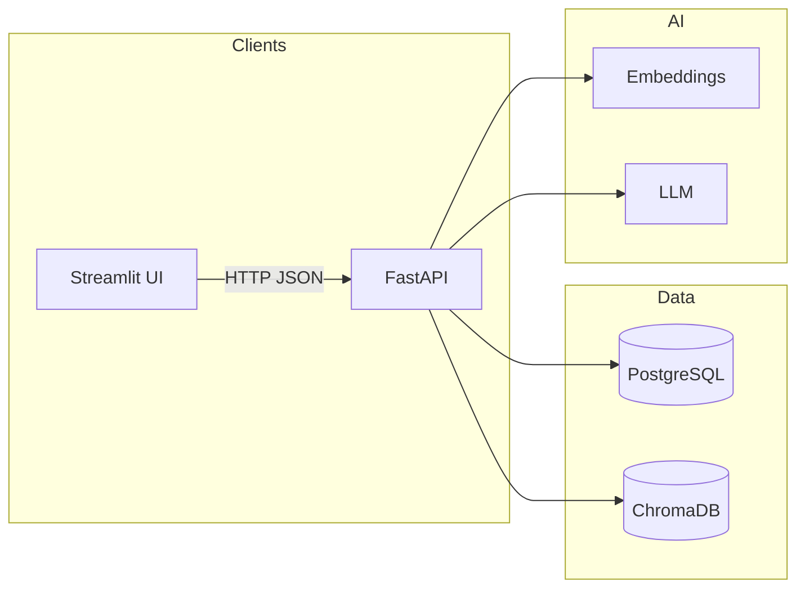

# RAG Knowledge Base Assistant

## Ask Questions, Get Cited Answers from Your Company Documents

## >85% accuracy | Source citations | 50+ evaluation test cases

This repository implements a production-style **retrieval-augmented generation (RAG)** stack: documents are parsed, chunked, embedded, and indexed in **ChromaDB**; user questions are retrieved against grounded evidence, answered with an LLM, and returned with **structured citations** (document title, page/section anchor, relevance score). **Guardrails** block prompt injection and enforce PII policy before generation.

---

## Problem

Teams store policies, playbooks, and procedures across PDFs, Word files, and Markdown. Generic chat models **hallucinate** or use stale general knowledge. Internal search is often **keyword-only** and misses paraphrased questions. The problem is to deliver **accurate, attributable answers** from *your* corpus, with **access control**, **auditability**, and **safe refusal** when evidence is insufficient.

---

## Solution

- **Ingestion**: Multi-format parsing → header-aware chunking → embeddings → **idempotent** upsert into Chroma with metadata (collection, restriction level, versioning flags).
- **Retrieval**: Configurable strategies — **similarity**, **MMR** (default for diversity), **hybrid** (dense + keyword window; feature-flagged). **Query rewriting** runs only when deterministic heuristics say the question is underspecified.
- **Generation**: Grounded prompts with **citations**, confidence scoring, and explicit refusal paths (guardrails, PII, low relevance, cost cap).
- **Operations**: Postgres for documents, conversations, query analytics, and ingestion jobs; **metrics** endpoint for cost and query aggregates.

---

## Architecture



---

## Evaluation Results

- **Automated tests**: **173** unit and integration tests (run `make test`).
- **Offline evaluation**: `make evaluate` runs the evaluation pipeline over `eval/test_set.jsonl` and sample docs; reports are written under `eval/results/` (see `docs/runbook.md`).
- Target **>85%** groundedness/correctness on the curated set is documented as a project goal; exact headline numbers depend on the model, corpus, and judge configuration used when you run `make evaluate --with-llm` (optional, cost-bearing).

---

## Key Features

| Area | Capability |
|------|------------|
| Retrieval | Similarity, MMR, hybrid (flag), query rewrite heuristics |
| Safety | Prompt-injection patterns, PII block/redact, relevance thresholds |
| Memory | Multi-turn **conversations** stored in Postgres |
| Admin | Document lifecycle, collections, **re-index** triggers |
| Observability | Correlation IDs, structured logs, **/api/v1/metrics** |

---

## Tech Stack

- **API**: FastAPI, Pydantic Settings, Uvicorn  
- **DB**: PostgreSQL (SQLAlchemy 2 + Alembic), asyncpg  
- **Vectors**: ChromaDB (HTTP client)  
- **ML**: sentence-transformers / OpenAI embeddings; OpenAI chat for generation  
- **UI**: Streamlit (`frontend/app.py`)  
- **Quality**: Ruff, Mypy, Pytest  

---

## How to Run

### Prerequisites

- Python 3.12+ recommended (3.11+ supported in CI)  
- Docker (for Postgres + Chroma + API)

### API (Docker)

```bash
docker-compose up --build
```

- API: `http://localhost:8000` (configurable via `API_PORT`)
- Chroma **host** port defaults to **8001** (avoids clashing with the API on 8000). Inside the Compose network the app uses `chromadb:8000`.
- OpenAPI (Swagger): `http://localhost:8000/api/v1/docs` when `DEBUG=true` (default in compose)
- Health: `GET http://localhost:8000/api/v1/health`

### Streamlit UI

```bash
pip install -r requirements.txt
make ui
# or: RAG_API_BASE=http://localhost:8000/api/v1 streamlit run frontend/app.py
```

### Tests and quality

```bash
pip install -r requirements-dev.txt
make migrate   # if using local Postgres
make lint && make typecheck && make test
```

---

## Architecture Decisions

Decisions are captured in project ADRs (see `docs/`):

- **ADR 001**: ChromaDB for the vector store  
- **ADR 002**: MMR-first retrieval, hybrid optional, query rewriting behind heuristics  
- **ADR 003**: Recursive + header-aware chunking  
- **ADR 004**: Guardrails and grounded generation  
- **ADR 005**: Evaluation metrics and citation checks  
- **ADR 006**: Embedding provider abstraction  
- **ADR 007**: LLM provider and prompting strategy  

---

## Documentation

- **Runbook**: `docs/runbook.md` — health checks, failures, re-index, evaluation output  
- **Definition of Done**: `docs/DEFINITION_OF_DONE.md` — release checklist  
- **Changelog**: `CHANGELOG.md` — phase history  

---

## License

See repository license (if provided).
